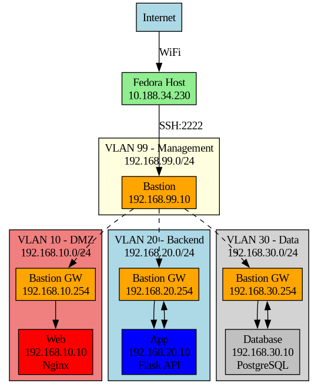

# infrastructure virtualisée sécurisée

projet d'infrastructure reseau avec segmentation vlan et architecture multi-tier

## contexte

j'ai monté ce lab pour apprendre les bases du routage inter-vlan, la segmentation reseau et la securisation d'infrastructure. au depart c'etait juste pour comprendre comment isoler des services entre eux mais c'est devenu un projet plus complet.

## architecture



### composants

- **bastion** (192.168.99.254) : routeur central + firewall
- **web** (192.168.10.10) : serveur nginx en dmz
- **app** (192.168.20.10) : api flask
- **database** (192.168.30.10) : postgresql

chaque vm est sur son propre vlan pour l'isolation. le bastion a une interface sur chaque vlan et fait le routage entre eux.

## ce que j'ai appris

### vlans et segmentation

au debut j'ai essayé de laisser kvm gerer le routage automatiquement mais ça marchait pas. les bridges virtuels (virbr-*) ne routaient pas entre eux meme avec ip_forward activé.

la solution : donner plusieurs interfaces au bastion et configurer le routage manuellement. ça m'a fait comprendre comment un routeur fonctionne vraiment.

### problemes rencontrés

**conflit d'adresses mac** : le plus gros probleme que j'ai eu. le bridge kvm (virbr-nd) avait la meme ip que l'interface du bastion (192.168.20.1). resultat : app envoyait les paquets au bridge au lieu du bastion.

solution trouvée : 
```bash
# verifier les mac
ip link show virbr-nd
sudo virsh domiflist bastion

# forcer la bonne mac dans arp
sudo arp -s 192.168.20.1 52:54:00:97:cc:1e
```

sauf que ça a bloqué le terminal et cassé le reseau. j'ai du :
1. acceder via console virt-manager
2. supprimer l'entree arp (`sudo arp -d 192.168.20.1`)
3. redemarrer ssh
4. reconfigurer le reseau virtuel

**routage qui marchait pas** : pendant longtemps app pouvait pas ping database. les paquets arrivaient au bastion mais repartaient pas.

ce qui manquait :
```bash
# activer le forwarding
echo 1 > /proc/sys/net/ipv4/ip_forward

# desactiver reverse path filtering
sysctl -w net.ipv4.conf.all.rp_filter=0
```

**mode nat vs route dans libvirt** : au final j'ai du passer les reseaux virtuels de mode "nat" à mode "route" pour que libvirt arrete de bloquer le trafic inter-vlan.
```bash
sudo virsh net-edit vlan20-backend
# changer <forward mode='nat'/> en <forward mode='route'/>
```

## securité

### ssh

port 22 fermé, seulement 2222 avec clés :
```bash
# generation des clés
ssh-keygen -t ed25519 -f ~/.ssh/bastion_key

# copie sur le serveur
ssh-copy-id -i ~/.ssh/bastion_key.pub admelmoh@192.168.99.254

# config dans /etc/ssh/sshd_config
Port 2222
PasswordAuthentication no
PermitRootLogin no
```

### fail2ban

configuré pour bloquer apres 3 tentatives ratées :
```ini
[sshd]
enabled = true
port = 2222
maxretry = 3
bantime = 600
findtime = 300
```

j'ai testé en faisant expres des mauvais mots de passe et effectivement apres 3 essais l'ip est bannie (connection refused).

### firewall

regles iptables sur le bastion :
```bash
# politique par defaut : bloquer
iptables -P INPUT DROP
iptables -P FORWARD DROP
iptables -P OUTPUT ACCEPT

# autoriser ssh sur 2222
iptables -A INPUT -p tcp --dport 2222 -j ACCEPT

# routage entre vlans
iptables -A FORWARD -m state --state ESTABLISHED,RELATED -j ACCEPT
iptables -A FORWARD -s 192.168.10.0/24 -d 192.168.20.0/24 -p tcp --dport 3000 -j ACCEPT
iptables -A FORWARD -s 192.168.20.0/24 -d 192.168.30.0/24 -p tcp --dport 5432 -j ACCEPT
```

## tests effectués

### connectivité
```bash
# depuis bastion
ping 192.168.10.10  # web
ping 192.168.20.10  # app  
ping 192.168.30.10  # db

# traceroute depuis app vers db
traceroute 192.168.30.10
# resultat : passe bien par 192.168.20.254 puis 192.168.30.254
```

### services
```bash
# web
curl http://192.168.10.10
# retourne la page html

# api
curl http://192.168.20.10:3000/health
# {"api":"ok","database":"ok"}

curl http://192.168.20.10:3000/users
# retourne les 3 users de la db
```

### securité
```bash
# test port 22 (doit etre fermé)
nmap -p 22 192.168.99.254
# filtered (timeout)

# test ssh avec password (doit echouer)
ssh -o PubkeyAuthentication=no admelmoh@192.168.99.254 -p 2222
# permission denied

# test fail2ban (3 tentatives)
# apres 3 echecs : connection refused
```

## liens utiles

- [libvirt networking](https://wiki.libvirt.org/page/VirtualNetworking)
- [kvm networking modes](https://access.redhat.com/documentation/en-us/red_hat_enterprise_linux/7/html/virtualization_deployment_and_administration_guide/sect-virtual_networking-network_configuration_with_virsh)
- [iptables routing](https://www.karlrupp.net/en/computer/nat_tutorial)
- [fail2ban config](https://www.fail2ban.org/wiki/index.php/Configuration)

## reproductibilité

pour recréer ce lab :

1. installer kvm/libvirt
2. créer les 4 reseaux virtuels (voir configs/network/)
3. créer les 4 vms avec ubuntu server
4. configurer le bastion avec plusieurs interfaces
5. appliquer les scripts de configuration

details complets dans `docs/installation.md`

## notes

- les vms utilisent ~40gb d'espace disque
- 8gb de ram minimum (2gb par vm)
- testé sur fedora 42 avec kvm
