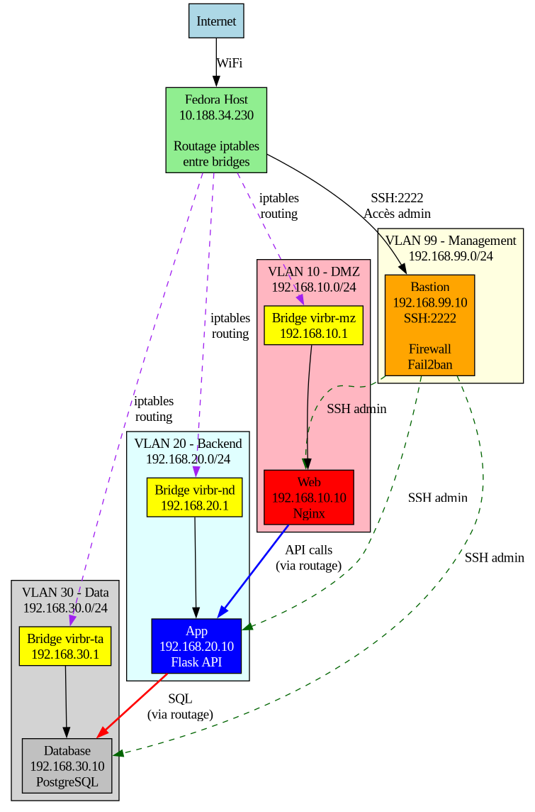

# Lab - Infrastructure Multi-Tier Sécurisée

> **Note** : Ce projet est en développement actif. L'architecture actuelle est fonctionnelle mais l'objectif reste d'implémenter l'architecture cible avec bastion routeur multi-interface.

Projet personnel développé dans le cadre de ma formation en Ingénierie des Systèmes Informatiques.

L'objectif est de créer une infrastructure virtualisée complète avec segmentation réseau, bastion sécurisé, et architecture multi-tier (Web/App/Database).

## Architecture actuelle



### Composants

- **Hôte Fedora** : Gère le routage inter-VLAN via iptables
- **Bastion** : Point d'entrée SSH sécurisé (une seule interface sur VLAN 99)
- **Web** : Serveur Nginx en DMZ (VLAN 10)
- **App** : API Flask backend (VLAN 20)
- **Database** : PostgreSQL (VLAN 30)

### Segmentation réseau

- **VLAN 99 (Management)** : 192.168.99.0/24 - Bastion uniquement
- **VLAN 10 (DMZ)** : 192.168.10.0/24 - Serveur Web exposé
- **VLAN 20 (Backend)** : 192.168.20.0/24 - Application backend
- **VLAN 30 (Data)** : 192.168.30.0/24 - Base de données isolée

### Rôle du bastion

Le bastion sert de **jump host** pour l'administration :
- Seul point d'entrée SSH depuis Internet (port 2222)
- Toutes les connexions SSH vers les autres VMs passent par le bastion
- Protégé par fail2ban et firewall iptables
- Contrôle d'accès centralisé avec authentification par clés

Pour administrer une VM :
```bash
# Depuis le laptop
ssh bastion                    # Se connecter au bastion
ssh admelmoh-web@192.168.10.10 # Depuis le bastion, SSH vers web
```

Ou avec SSH ProxyJump :
```bash
# Configuration dans ~/.ssh/config
Host web
    HostName 192.168.10.10
    User admelmoh-web
    ProxyJump bastion

# Connexion directe tunnelisée via bastion
ssh web
```

## Architecture cible (en cours de développement)

L'architecture actuelle est une version simplifiée. L'objectif initial était de faire du bastion un véritable routeur multi-interface gérant le routage inter-VLAN.

### Architecture prévue


Dans cette architecture cible :
- Le bastion aurait 4 interfaces réseau (une par VLAN)
- Il gérerait le routage inter-VLAN avec iptables FORWARD
- Il appliquerait des règles de filtrage granulaires entre les VLANs
- Il servirait à la fois de point d'entrée SSH et de routeur

### Pourquoi l'architecture actuelle est différente

Lors de l'implémentation, j'ai rencontré un problème de conflit d'adresses : les bridges KVM et le bastion avaient tous les deux les adresses .1 de chaque VLAN, ce qui causait des conflits ARP et empêchait le routage de fonctionner correctement.

Détails techniques : voir [docs/problemes/conflit-bridges-kvm.md](docs/problemes/conflit-bridges-kvm.md)

Face aux contraintes de temps, j'ai opté pour une architecture simplifiée mais fonctionnelle où :
- Les bridges KVM conservent les adresses .1 (leur rôle naturel)
- Le bastion se concentre sur le contrôle d'accès SSH
- L'hôte Fedora gère le routage via iptables

Cette approche a l'avantage d'être plus simple et de séparer clairement les responsabilités, mais l'objectif reste d'implémenter l'architecture complète avec bastion routeur.

### Perspectives d'amélioration

- **Court terme** : Résoudre le conflit d'adresses pour implémenter le bastion multi-interface
- **Moyen terme** : Ajouter des règles de filtrage granulaires entre VLANs au niveau du bastion
- **Long terme** : Automatiser complètement le déploiement avec Ansible

## Technologies utilisées

- **Virtualisation** : KVM/QEMU (libvirt)
- **OS** : Ubuntu Server 24.04 LTS
- **Réseau** : VLANs, routage inter-VLAN, NAT
- **Sécurité** : iptables, fail2ban, SSH avec clés
- **Services** : 
  - Web : Nginx
  - Backend : Python Flask + API REST
  - Database : PostgreSQL 16

## Points techniques importants

### Routage inter-VLAN

Le routage entre VLANs est actuellement géré par l'hôte Fedora via les bridges KVM en mode NAT, avec configuration iptables pour le masquerading.

Configuration requise sur l'hôte :
```bash
# Activer le forwarding
sudo sysctl -w net.ipv4.ip_forward=1

# Désactiver reverse path filtering
sudo sysctl -w net.ipv4.conf.all.rp_filter=0

# NAT masquerading pour chaque VLAN
sudo iptables -t nat -A POSTROUTING -s 192.168.99.0/24 -j MASQUERADE
sudo iptables -t nat -A POSTROUTING -s 192.168.10.0/24 -j MASQUERADE
sudo iptables -t nat -A POSTROUTING -s 192.168.20.0/24 -j MASQUERADE
sudo iptables -t nat -A POSTROUTING -s 192.168.30.0/24 -j MASQUERADE
```

### Sécurité

- SSH configuré avec authentification par clés uniquement
- Port SSH modifié (2222) sur le bastion
- Fail2ban actif pour bloquer les tentatives de bruteforce
- Firewall iptables avec politique DROP par défaut
- Segmentation réseau stricte entre les VLANs
- Sudo sans password pour faciliter l'automatisation (environnement lab uniquement)

## Documentation

### Installation et configuration

- **[Guide d'installation](docs/installation.md)** - Instructions complètes étape par étape pour reproduire l'infrastructure
- **[Guide de configuration](docs/configuration.md)** - Détails de configuration de chaque composant (bastion, services, réseau)
- **[Scripts d'automatisation](scripts/)** - Scripts bash commentés pour automatiser le déploiement

### Problèmes rencontrés et solutions

- **[Routage inter-VLAN](docs/problemes/routage-intervlan.md)** - Problème principal rencontré : les VMs ne communiquaient pas entre VLANs. Tentatives avec mode route, bastion multi-interface, et solution finale avec routage par l'hôte.
- **[Conflit bridges KVM](docs/problemes/conflit-bridges-kvm.md)** - Conflit d'adresses MAC/IP entre les bridges KVM et les interfaces du bastion. Diagnostic avec tcpdump et arp, solution appliquée.
- **[Configuration SSH](docs/problemes/ssh-config.md)** - Problèmes d'authentification SSH, configuration des clés, et sécurisation (port custom, PasswordAuthentication, fail2ban).

### Tests et validation

- **[Tests de validation](docs/tests.md)** - Tous les tests effectués : connectivité réseau, services, sécurité, résilience. Résultats et commandes de vérification.

## Installation

### Prérequis

- Fedora 41+ (ou distribution Linux avec KVM)
- 16 GB RAM minimum (recommandé : 32 GB)
- 100 GB d'espace disque libre
- Virtualisation activée dans le BIOS (Intel VT-x / AMD-V)
- Accès sudo sur l'hôte

### Installation rapide
```bash
# Cloner le projet
git clone https://github.com/votre-username/cybersec-lab.git
cd cybersec-lab

# Installation de KVM
sudo dnf install @virtualization
sudo systemctl enable --now libvirtd

# Création des réseaux virtuels
cd scripts
sudo ./create-vlans.sh

# Suivre le guide d'installation complet
# Voir docs/installation.md pour les étapes détaillées
```

### Résumé des étapes principales

1. **Installation de KVM/libvirt** sur l'hôte Fedora
2. **Création des 4 réseaux virtuels** (VLANs) avec les scripts fournis
3. **Création des 4 VMs** avec Ubuntu Server 24.04
4. **Configuration réseau sur l'hôte** : ip_forward, rp_filter, iptables
5. **Configuration des IPs statiques** sur chaque VM
6. **Sécurisation du bastion** : SSH avec clés, fail2ban, firewall
7. **Installation des services** : nginx, flask, postgresql
8. **Tests de validation** : connectivité, services, sécurité

Guide complet : [docs/installation.md](docs/installation.md)

## Tests

Voir [docs/tests.md](docs/tests.md) pour la documentation complète des tests.

### Tests effectués

- **Connectivité réseau** : ping entre VLANs, traceroute, vérification des routes
- **Services** : nginx accessible, API Flask fonctionnelle, PostgreSQL connecté
- **Sécurité** : SSH avec clés uniquement, fail2ban actif, firewall configuré
- **Résilience** : redémarrage des services, tests après reboot des VMs

Tous les tests sont passés avec succès. Les commandes de test sont documentées pour permettre la reproduction.

En cas de problème, consulter d'abord [docs/problemes/](docs/problemes/) pour voir si le problème est déjà documenté.

## Améliorations futures

### Court terme
- Résoudre le conflit d'adresses pour implémenter le bastion comme routeur multi-interface
- Ajouter des règles de filtrage granulaires entre VLANs
- Implémenter HTTPS sur le serveur web avec certificats auto-signés

### Moyen terme
- Automatisation complète avec Ansible
- Monitoring avec Prometheus et Grafana
- Centralisation des logs avec rsyslog
- Backups automatiques de PostgreSQL

### Long terme
- Tests de pénétration sur l'infrastructure (nmap, metasploit)
- Mise en place d'un IDS/IPS (Snort ou Suricata)
- Déploiement dans un environnement cloud (AWS, Azure)
- Documentation vidéo avec démonstration complète

## Ressources et références

### Documentation technique

- [Libvirt networking](https://wiki.libvirt.org/page/VirtualNetworking) - Documentation officielle sur les réseaux virtuels
- [KVM networking modes](https://access.redhat.com/documentation/en-us/red_hat_enterprise_linux/7/html/virtualization_deployment_and_administration_guide/sect-virtual_networking-network_configuration_with_virsh) - Modes de configuration réseau sous KVM
- [Iptables routing and NAT](https://www.karlrupp.net/en/computer/nat_tutorial) - Tutoriel sur le routage et NAT avec iptables
- [Fail2ban configuration](https://www.fail2ban.org/wiki/index.php/Configuration) - Configuration de fail2ban
- [PostgreSQL authentication](https://www.postgresql.org/docs/current/auth-pg-hba-conf.html) - Configuration pg_hba.conf

### Guides et tutoriels

- [SSH hardening](https://www.ssh.com/academy/ssh/config) - Sécurisation de SSH
- [Netplan configuration](https://netplan.io/examples/) - Configuration réseau sous Ubuntu
- [Flask API best practices](https://flask.palletsprojects.com/en/2.3.x/) - Bonnes pratiques Flask
- [Nginx security](https://www.nginx.com/blog/nginx-security-best-practices/) - Sécurisation nginx

### Outils utilisés

- [tcpdump](https://www.tcpdump.org/) - Capture et analyse de paquets réseau
- [nmap](https://nmap.org/) - Scan de ports et découverte réseau
- [virsh](https://www.libvirt.org/manpages/virsh.html) - Gestion des machines virtuelles

## Contexte du projet

Ce projet personnel a été réalisé dans le cadre de ma formation en Ingénierie des Systèmes Informatiques. L'objectif était de mettre en pratique les concepts de segmentation réseau, sécurisation des accès, et architecture multi-tier dans un environnement virtualisé.

Le projet m'a permis de :
- Comprendre en profondeur le routage inter-VLAN
- Diagnostiquer et résoudre des problèmes réseau complexes
- Documenter une infrastructure de manière professionnelle
- Apprendre à faire des choix d'architecture pragmatiques

Les difficultés rencontrées (notamment le conflit d'adresses entre bridges KVM et bastion) ont été formatrices et m'ont permis d'approfondir ma compréhension du fonctionnement réseau au niveau MAC et IP.

---

**Note** : Ce projet est en développement actif. L'architecture actuelle est fonctionnelle mais l'objectif reste d'implémenter l'architecture cible avec bastion routeur multi-interface.